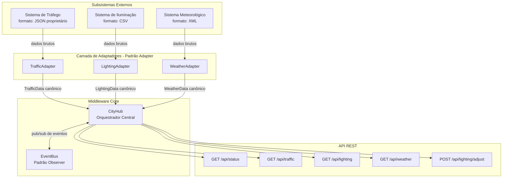
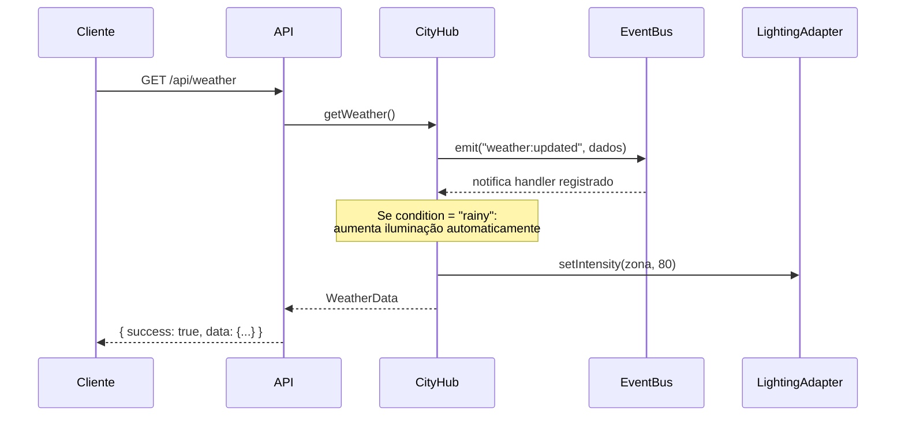

# Smart City Middleware
adriano jr, joao marcio
Middleware de integração urbana que conecta sistemas heterogêneos de uma cidade inteligente por meio de APIs padronizadas, abordando o desafio de **Interoperabilidade e Fragmentação** em Smart Cities.

## Problema

Cidades inteligentes são compostas por dezenas de sistemas de fornecedores diferentes — cada um com seu próprio formato de dados, protocolo e interface. Essa fragmentação cria silos de informação, impede automação cruzada e gera dependência excessiva de fornecedores (*vendor lock-in*).

## Solução

Este projeto implementa um **middleware central (CityHub)** que:

- Normaliza dados heterogêneos para um schema canônico único
- Desacopla os subsistemas por meio de um EventBus (padrão Observer)
- Expõe uma API REST unificada para consumo externo
- Permite trocar qualquer subsistema sem impactar os demais

---

## Arquitetura



### Fluxo de Eventos (Observer Pattern)



---

## Padrões de Projeto Utilizados

| Padrão | Onde | Por quê |
|--------|------|---------|
| **Adapter** | `src/adapters/` | Converte formatos proprietários (JSON, CSV, XML) para o schema canônico sem alterar os sistemas originais |
| **Strategy** | Adaptadores como estratégias intercambiáveis | Permite trocar o fornecedor de qualquer subsistema sem modificar o CityHub |
| **Observer / Event Bus** | `src/core/EventBus.ts` | Comunicação assíncrona e desacoplada entre subsistemas — mudanças em um notificam os demais automaticamente |
| **Singleton** | `eventBus` exportado | Garante um único canal de eventos compartilhado por toda a aplicação |
| **Dependency Injection** | Construtor do `CityHub` | Facilita testes unitários com mocks dos adaptadores |

---

## Estrutura do Projeto

```
desafios/projeto clovis/
├── grupo.txt                   ← Membros do grupo
├── src/
│   ├── adapters/
│   │   ├── TrafficAdapter.ts   ← Converte JSON proprietário → TrafficData
│   │   ├── LightingAdapter.ts  ← Converte CSV → LightingData
│   │   └── WeatherAdapter.ts   ← Converte XML → WeatherData
│   ├── core/
│   │   ├── CityHub.ts          ← Middleware central — orquestra e normaliza
│   │   └── EventBus.ts         ← Canal pub/sub para comunicação entre subsistemas
│   ├── models/
│   │   └── CityDataSchema.ts   ← Interfaces TypeScript do schema canônico
│   ├── routes/
│   │   └── index.ts            ← Endpoints REST
│   └── server.ts               ← Entry point da aplicação
├── tests/
│   ├── adapters.test.ts        ← Testes dos três adaptadores
│   └── cityHub.test.ts         ← Testes do hub e EventBus
├── package.json
├── tsconfig.json
└── .gitignore
```

---

## Como Executar

### Pré-requisitos

- Node.js >= 18
- npm >= 9

### Instalação e execução

```bash
npm install && npm run dev
```

O servidor sobe em `http://localhost:3000`.

### Testes

```bash
npm test
```

---

## Endpoints da API

### `GET /api/status`

Retorna o estado consolidado de todos os subsistemas.

```json
{
  "success": true,
  "data": {
    "traffic": [...],
    "lighting": [...],
    "weather": { ... },
    "lastSyncAt": "2024-05-10T14:30:00.000Z"
  }
}
```

### `GET /api/traffic`

Dados de tráfego normalizados de todas as seções monitoradas.

### `GET /api/lighting`

Dados de iluminação de todas as zonas urbanas.

### `GET /api/weather`

Dados meteorológicos atuais.

### `POST /api/lighting/adjust`

Ajusta a iluminação de uma zona. Se `targetIntensity` for omitido, o hub calcula automaticamente com base em tráfego e clima.

**Body:**
```json
{
  "zoneId": "ZONA-NORTE",
  "targetIntensity": 85
}
```

**Lógica de cálculo automático:**
- Base: 50%
- +30% se congestionamento > 70%
- +20% se houver chuva ou tempestade
- -20% se luminosidade natural > 70 (pleno dia)

---

## Membros do Grupo

Adriano Jr · João Márcio · Vinicius Barbosa
